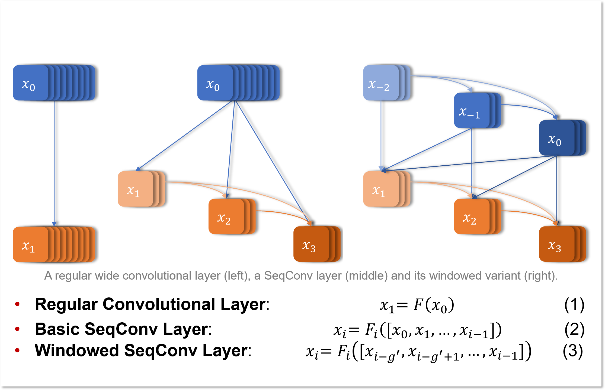
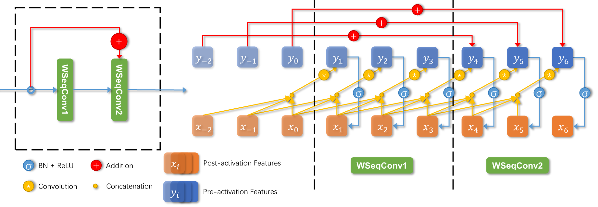
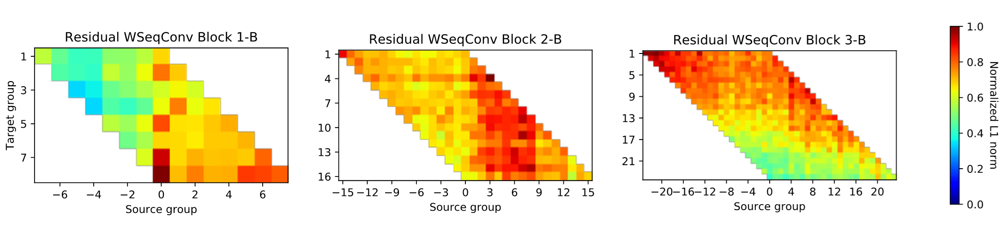
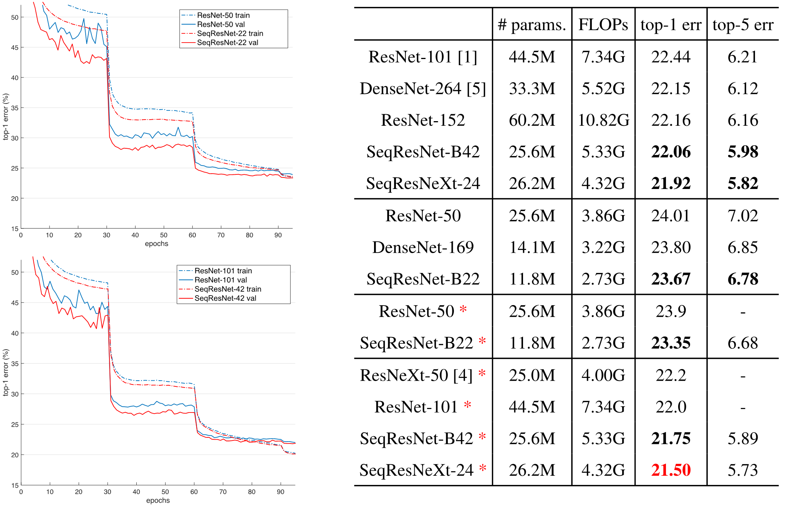

# SeqConv

Offical implementation of paper [Sequentially Aggregated Convolutional Networks](http://openaccess.thecvf.com/content_ICCVW_2019/papers/NeurArch/Huang_Sequentially_Aggregated_Convolutional_Networks_ICCVW_2019_paper.pdf)

## Problem and Motivation

Ever since the groundbreaking success of ResNet [1], shortcut connections have been regarded as a key component of modern deep networks. The aggregation nature of shortcut connections was however often neglected. What could we learn from this perspective and how would it help us design new network architectures?

## Related Work

+ Ensembles of relatively shallow networks [2, 3].
+ Aggregated transformations [4, 5, 6].

## Contribution

+ Aggregation based convolutional layers.
+ New interpretation of DenseNet-like architectures.
+ Windowed aggregation.
+ New SOTA results on ImageNet [7]. (compared to other models of similar complexity)

## Network Architecture   

<div align="center">
	
</div>

Eq.3 is equivalent to applying a sliding rectangular window 𝜙 across the channel dimension on Eq.2.

<div align="center">
	
</div>

SeqConv could be handily integrated into any backbone network, the following illustration shows a pre-activation residual block [8] with windowed SeqConv layers.

## Results

Weight visualization on trained WSeqConv layers indicates that the win-dowed aggregation mechanism has much higher overall utilization
on aggregated feature groups than dense aggregation.

<div align="center">
	
</div>

By simply replacing each convolutional layer in ResNet [8] and ResNeXt [4], our SeqConv based models achieve SOTA results on ImageNet [7] classification.

<div align="center">
	
</div>

## Citation

If you find this project useful, please consider citing us:

```
@InProceedings{Huang_2019_ICCV_Workshops,
author = {Huang, Yiwen and Ou, Pinglai and Wu, Rihui and Feng, Ziyong},
title = {Sequentially Aggregated Convolutional Networks},
booktitle = {The IEEE International Conference on Computer Vision (ICCV) Workshops},
month = {Oct},
year = {2019}
} 
```

## References

[1] K. He et al. Deep residual learning for image recognition. In: CVPR. 2016.

[2] A. Veit et al. Residual networks behave like ensembles of relatively shallow networks. In: NIPS. 2016. 

[3] G. Huang et al. Deep networks with stochastic depth. In: ECCV. 2016.

[4] S. Xie et al. Aggregated residual transformations for deep neural networks. In: CVPR. 2017.

[5] G. Huang et al. Densely connected convolutional networks. In: CVPR. 2017.

[6] H. Liu et al. DARTS: Differentiable Architecture Search. In: ICLR. 2019.

[7] J. Deng et al. Imagenet: a large-scale hierarchical image database. In: CVPR. 2009.

[8] K. He et al. Identity mappings in deep residual networks. In: ECCV. 2016.
